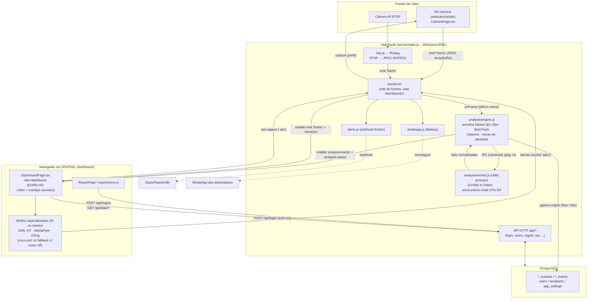

# Visão Geral e Arquitetura do Sistema

> **Projeto:** Visão de Pátio — POC / MVP de visão computacional industrial
> **Pacotes:** `visao_patio_mvp` (frontend) + `visao_patio_hub` (servidor)
> **Documento:** gerado a partir da leitura do código-fonte (não altera a pasta `docs/`).
> **Data de geração:** 2026-06-28

---

## 1. Propósito do sistema

O **Visão de Pátio** é um MVP web de **inteligência operacional por área** baseado em
visão computacional. Ele transforma câmeras comuns (webcams, celulares e câmeras IP/RTSP)
em sensores de operação, analisando o vídeo para extrair indicadores como movimentação,
ocupação, contagem de pessoas, permanência, leitura de códigos de barras e fadiga de
operadores — tudo isso com dois princípios de projeto explícitos no código:

- **Análise de indicadores no hub; navegador = espelho (ADR-009, jul/2026):** a detecção
  de pessoas, tracking, contagem por linha e atividade/ocupação rodam **no servidor**, num
  worker process dedicado (`server/analysis/` — motor D-FINE-N via onnxruntime-node, CPU EP,
  1–2 fps/câmera, 24/7, independente de espectador). O navegador exibe vídeo + overlays
  servidos (`analysis-tracks`) e roda **no cliente apenas os modos especializados**
  (Fadiga/MediaPipe, Leitura/ZXing, Objetos/OWL-ViT); a detecção coco-ssd local permanece
  só como fallback quando o motor está desligado. Detalhes: `server/analysis/README.md` e
  `analises/decisoes/ADR-009-analise-server-side.md`.
- **Privacidade by design (LGPD):** sem upload persistente de vídeo, sem reconhecimento
  facial e sem identificação individual. Pessoas recebem IDs efêmeros ("Pessoa N") que
  somem ao sair (`README.md:47-48`, `src/config.ts:32`).

A aplicação possui **dois papéis** que rodam a mesma SPA, mas em rotas diferentes:

| Papel | Rota | Função |
|-------|------|--------|
| **Central (dashboard)** | `/`, `/relatorio`, `/usuarios`, `/perfil` | Recebe os frames de todas as câmeras, **roda a IA**, gerencia zonas/alertas, exibe relatórios e administra usuários. Exige login humano. |
| **Nó de câmera** | `/camera` | Mostra **apenas o feed** (sem controles) e transmite frames JPEG ao hub. Autentica por token de dispositivo (`?key=`) ou pela sessão de um humano logado. |

Referência das rotas: `src/main.tsx:13-26`.

---

## 2. Arquitetura macro

### 2.1 Componentes

1. **Frontend SPA (React + Vite)** — uma única aplicação que assume um de dois papéis
   conforme a rota:
   - *Dashboard*: conecta ao hub como `role=dashboard`, recebe `frame`/`cameras`,
     decodifica os JPEGs em `ImageBitmap` e roda os pipelines de visão
     (`src/routes/DashboardPage.tsx:32-57`).
   - *Câmera*: captura a webcam, codifica frames em JPEG binário e os envia via socket
     (`src/routes/CameraPage.tsx:53-86`).
2. **Hub (servidor Node)** — HTTP + Socket.IO no mesmo processo
   (`server/index.js`). Faz quatro coisas:
   - **Relé de frames** câmera→dashboard (não persiste vídeo).
   - **Motor de análise** (`server/analysis/`, ADR-009): `engine.js` (in-process) amostra
     os frames do relé @1–2 fps e envia ao `worker.js` (child process com D-FINE-N ONNX,
     CPU EP); as detecções passam por ByteTrack → tripwires/zonas → `pgstore.ingest`
     direto. Emite `analysis-status` e `analysis-tracks` (overlays) aos dashboards.
   - **API HTTP** (`/api/...`) para login, gestão de usuários, perfil, destinatários,
     configuração de notificações, WhatsApp, ingestão/consulta de histórico e
     `/api/analysis/status`.
   - **Integrações**: Postgres (histórico/usuários), WhatsApp (Baileys), webhook Andon,
     e ingestão de câmeras IP via ffmpeg (RTSP→JPEG).
3. **Postgres** — armazena **apenas indicadores agregados** (buckets por hora + eventos),
   usuários, destinatários e configurações; nunca vídeo (`server/db.js`, `server/pgstore.js`,
   `server/schema.sql`).
4. **WhatsApp / Andon** — canais de saída de alertas (`server/whatsapp.js`,
   `server/dispatch.js`, `server/alerts.js`).
5. **ffmpeg** (externo, no host do hub) — converte streams RTSP em frames JPEG para que
   câmeras IP entrem como câmeras comuns (`server/rtsp.js`).

### 2.2 Diagrama de fluxo (alto nível)



### 2.3 Sequência resumida do fluxo de frame

```
[webcam] --getUserMedia--> <video> --drawImage--> <canvas> --toBlob(jpeg)-->
   socket.emit("frame",{buf,w,h,ts})   (CameraPage.tsx:63-76)
        │
        ▼
[hub] socket.on("frame") -> io.to("dashboards").volatile.emit("frame")  (index.js:181-183)
        │   (VOLATILE = descarta frame se o dashboard estiver lento; prioriza o mais novo)
        ▼
[dashboard] socket.on("frame") -> createImageBitmap(Blob) -> pipelines de IA
        (DashboardPage.tsx:39-57)
        │
        ▼ (resultados agregados, fire-and-forget)
   POST /api/ingest  -> pgstore.ingest()  -> Postgres   (report/store.ts:17-18)
   socket.emit("alert") -> dispatch + WhatsApp + Andon   (index.js:206)
```

> **ADR-009:** para os indicadores de pessoas/atividade/fluxo, esse último passo mudou de
> lugar: o hub amostra o MESMO relé (`onFrame`, último-vence) para `analysis/engine.js` →
> `worker.js` (D-FINE) → `pgstore.ingest` direto — sem navegador no caminho. Quando o motor
> está ON para uma câmera (`analysis-status {engine:"hub"}`), o browser desliga o ingest dela
> e apenas desenha os `analysis-tracks` recebidos. Fadiga/Leitura/Objetos seguem o fluxo acima.

Pontos-chave de desempenho confirmados no código:
- **Frame volátil**: `socket.on("frame", ...).volatile.emit(...)` descarta em vez de
  enfileirar (`server/index.js:181-183`).
- **Anti-backlog no encode**: a câmera só envia um novo frame quando o `toBlob` anterior
  termina (`encoding` flag em `src/routes/CameraPage.tsx:62-76`).
- **Decode fora da main thread**: o dashboard guarda só o último frame e decodifica via
  `createImageBitmap` (`src/routes/DashboardPage.tsx:48-57`).

---

## 3. Stack tecnológica

### 3.1 Frontend — `package.json:1-53`

**Núcleo / build**
| Dependência | Versão | Para que serve |
|-------------|--------|----------------|
| `react` / `react-dom` | ^19.2 | Biblioteca de UI (SPA). |
| `react-router-dom` | ^7.17 | Roteamento client-side (`createBrowserRouter`). |
| `vite` | ^8.0 | Bundler / dev server / build. |
| `@vitejs/plugin-react` | ^6.0 | Suporte React (JSX/Fast Refresh) no Vite. |
| `typescript` | ~5.9 | Tipagem; `tsc` valida antes do build. |

**Comunicação com o hub**
| Dependência | Para que serve |
|-------------|----------------|
| `socket.io-client` ^4.8 | Conexão WebSocket com o hub (frames, câmeras, alertas). |
| (HTTP `fetch` nativo) | Chamadas REST `/api/*` em `src/api.ts` e `src/auth.tsx`. |

**Visão computacional (IA no navegador)**
| Dependência | Modo / uso |
|-------------|------------|
| `@tensorflow/tfjs` ^4.22 + `@tensorflow-models/coco-ssd` ^2.2 | Detecção de objetos/pessoas (modo **atividade/ocupação**), roda em Web Worker. Config em `src/config.ts:12-30`. |
| `@xenova/transformers` ^2.17 | Modo **objetos** zero-shot com OWL-ViT (`Xenova/owlvit-base-patch32`), em worker (`src/config.ts:94-100`). |
| `@mediapipe/tasks-vision` ^0.10 | Modo **fadiga**: FaceLandmarker + HandLandmarker (`src/config.ts:102-130`). |
| `@zxing/library` ^0.21 | Modo **leitura** de código de barras (fallback do `BarcodeDetector` nativo), em worker (`src/config.ts:63-92`). |

**UI / componentes (Radix UI)**
- `@radix-ui/react-*` (checkbox, dialog, dropdown-menu, label, scroll-area, select,
  slider, switch, tabs, toast, toggle-group, tooltip): primitivos acessíveis usados pela
  camada `src/ui/`.

**Testes E2E (devDependencies)**
- `@playwright/test` ^1.61: testes end-to-end (`e2e/`, `playwright.config.ts`).

### 3.2 Backend — `server/package.json:1-18`

| Dependência | Para que serve |
|-------------|----------------|
| `socket.io` ^4.8 | Servidor WebSocket (relé de frames + eventos). |
| `pg` ^8.21 | Cliente PostgreSQL (histórico, usuários, configs). |
| `@whiskeysockets/baileys` ^6.7 | Integração WhatsApp **não-oficial** (envio de alertas; pareamento por QR). |
| `qrcode` ^1.5 | Gera o QR de pareamento do WhatsApp. |
| `pino` ^9.5 | Logger estruturado. |
| `node:http`, `node:child_process`, `node:fs` | Módulos nativos: servidor HTTP, spawn do ffmpeg, leitura de schema/fontes. |
| **ffmpeg** (binário externo, no PATH) | Converte RTSP→JPEG (`server/rtsp.js`); não é dependência npm. |

**Runtime exigido:** Node `>=20` (`package.json:14-16`).

---

## 4. Mapa de diretórios comentado

```
visao_computacional_mvp/
├── index.html                  Ponto de entrada HTML; monta #app e carrega /src/main.tsx
├── package.json                Frontend (scripts dev/build/preview/hub/e2e) + dependências
├── tsconfig.json               Config TypeScript (strict, bundler mode, jsx react-jsx)
├── vite.config.ts              Plugin React + headers de segurança (CSP) só p/ dev/preview
├── playwright.config.ts        Orquestração dos testes E2E (hub :4100, vite :5180, webcam fake)
├── .env.production.example      Modelo de env de build (VITE_HUB_URL)
├── README.md                   Como rodar / arquitetura resumida / RTSP / privacidade
│
├── src/                        FRONTEND (SPA React) — processa a IA no navegador
│   ├── main.tsx                Bootstrap React + roteador (DEFINE AS ROTAS)
│   ├── config.ts               APP_CONFIG: TODOS os thresholds, modelos, rede (serverUrl), zonas
│   ├── api.ts                  Cliente REST autenticado (/api/me, /api/users, /api/wa-*, ...)
│   ├── auth.tsx                AuthProvider + tela de login (POST /api/login, token no localStorage)
│   ├── telemetry.ts            FrameMeter: FPS + latência média (buffer rolante)
│   ├── format.ts               Formatação compartilhada (duração, limite, relógio pt-BR)
│   ├── frame.ts                Tipos de fonte de frame (FrameSource, NormRect)
│   ├── zones.ts / zoneMask.ts  Modelo e máscara de zonas (regiões do frame)
│   ├── cameraConfig.ts         Config por câmera (modo, presets de captura) — persistência local
│   ├── CameraWorkspace.tsx     Workspace de uma câmera aberta (todos os modos)
│   ├── FadigaView.tsx          View do modo fadiga
│   ├── components/AppShell.tsx Shell persistente (rail lateral + <Outlet>); fora do /camera
│   ├── routes/                 Páginas: DashboardPage, CameraPage, ReportPage, UsersPage, ProfilePage
│   ├── ui/                     Design system sobre Radix (Button, Dialog, Select, Toast, Tooltip...)
│   ├── vision/                 coco-ssd: model.ts, detect.ts, detectWorker.ts (Web Worker)
│   ├── objects/                OWL-ViT zero-shot: detector.ts, owlvitWorker.ts, catalog.ts
│   ├── reading/                Código de barras: decoder.ts, zxingWorker.ts, cluster.ts
│   ├── fadiga/                 MediaPipe: landmarks, draw, models, calibration
│   ├── processors/             Pipelines por zona: atividade, leitura, objetos, fadiga, types
│   ├── report/                 Relatório: store.ts (API /ingest /data), csv.ts, mock.ts
│   └── camera/acquire.ts       Aquisição da webcam (contexto seguro + escada de constraints)
│
├── server/                     HUB (Node) — relé socket.io + API HTTP + integrações
│   ├── index.js                Entrypoint: HTTP + Socket.IO, rotas /api/*, salas, bootstrap
│   ├── db.js                   Pool Postgres (PG* ou DATABASE_URL); aplica schema.sql no boot
│   ├── schema.sql              Schema idempotente: *_buckets, *_events, users, recipients, app_settings
│   ├── pgstore.js              INGEST (upsert por bucket horário) + leitura buckets/events
│   ├── users.js / users.json   Autenticação, tokens de sessão, papéis; seed do superadmin
│   ├── recipients.js           Destinatários de WhatsApp
│   ├── settings.js             Configuração de notificações (templates por tipo)
│   ├── alerts.js               Andon: repassa alertas a webhook externo
│   ├── dispatch.js             Classifica/format. alertas e dispara WhatsApp p/ elegíveis
│   ├── whatsapp.js             Baileys: status/QR, envio de texto
│   ├── rtsp.js                 Ingestão RTSP via ffmpeg (RTSP→JPEG→evento "frame")
│   ├── rtsp.sources.example.json  Modelo de fontes RTSP (o real é gitignored)
│   └── wa-auth/                Estado de sessão do WhatsApp (Baileys)
│
├── e2e/                        Testes Playwright: app.spec.ts, global-setup/teardown
├── deploy/                     nginx-visao.conf (reverse proxy + CSP) e visao-hub.service (systemd)
├── docs/                       Documentação ORIGINAL (não tocar) — planos, manuais, avaliações
├── docs-regenerada/            Documentação regenerada (este arquivo)
├── dist/                       Build de produção do Vite (assets/ + index.html)
├── document_pdf.pdf            Documento de referência (PDF)
└── visao_computacional_mvp/    (anomalia) contém apenas package-lock.json órfão — a confirmar
```

> **Nota (a confirmar):** existe uma subpasta `visao_computacional_mvp/` dentro da raiz
> contendo somente um `package-lock.json` solto. Aparenta ser resíduo/erro de cópia, não
> um módulo do projeto. As pastas `dist/`, `node_modules/` e `test-results/` são geradas
> (build, deps e saída de testes).

---

## 5. Configuração e variáveis de ambiente

### 5.1 Configuração do frontend — `src/config.ts`

Praticamente toda a calibração da POC fica concentrada em `APP_CONFIG`
(`src/config.ts:3-159`). Blocos principais:

- `detection` — movimento (diff de frames) e ocupação (coco-ssd: modelo, intervalos,
  thresholds, tiling, NMS).
- `people` — contagem/permanência anônima (thresholds de tracking).
- `zones` — limites de inatividade para alerta (default 15 min; demo 10 s).
- `audio`, `timeline`, `metrics` — beep de alerta, timeline e janela de métricas.
- `reading` — leitura de código de barras (cadências, formatos, presets de captura,
  alerta de taxa).
- `objects` — OWL-ViT zero-shot.
- `fadiga` — MediaPipe (URLs de WASM/modelos, EAR/MAR thresholds, índices de landmarks).
- `net` — **resolução do endereço do hub** (ver abaixo) + resolução/fps/qualidade dos frames.
- `defaultZones` — zonas iniciais (frações 0..1 do frame).

**Resolução do endpoint do hub** (`src/config.ts:140-144`), em 3 níveis:
1. `VITE_HUB_URL` (build-time) — força um endpoint explícito (ex.: hub dedicado).
2. Produção (HTTPS): **mesma origem** (`location.origin`) → o socket sobe via `wss://` no
   mesmo domínio, com o web server fazendo proxy de `/socket.io/`.
3. Dev: `http://<hostname>:4000` (permite celular apontar para o IP do laptop).

### 5.2 Variável de build do frontend — `.env.production.example`

| Variável | Default | Descrição |
|----------|---------|-----------|
| `VITE_HUB_URL` | (vazio) | Só necessária se o hub estiver em outro host/domínio. Em produção same-origin não precisa definir. |

### 5.3 Variáveis de ambiente do hub — `server/index.js`, `server/db.js`, `deploy/visao-hub.service`

| Variável | Default | Uso |
|----------|---------|-----|
| `PORT` | `4000` (prod: `8091`) | Porta do hub (`server/index.js:15`). |
| `HOST` | `0.0.0.0` (prod: `127.0.0.1`) | Interface de escuta; em prod só o reverse proxy alcança (`index.js:16-18`). |
| `AUTH_SECRET` | — | Assina os tokens de sessão (definir valor forte em prod; `visao-hub.service:28`). |
| `SUPERADMIN_USER` / `SUPERADMIN_PASSWORD` | — | Cria o superadmin no 1º boot se `users.json` estiver vazio. |
| `CAMERA_TOKEN` | — | Token de dispositivo (F4): nós `/camera` autenticam sem login humano (`index.js:153`, `/api/camera-enroll`). |
| `DATABASE_URL` *ou* `PGHOST`/`PGPORT`/`PGUSER`/`PGPASSWORD`/`PGDATABASE` (alias `VISAO_DB`) | — | Conexão Postgres. Sem isso, o hub sobe mas o histórico fica indisponível (`db.js:12-32`). |
| `ALERT_WEBHOOK_URL` | — | Liga o Andon (webhook Slack/Teams/n8n). `ALERT_DEDUP_MS` = janela anti-repetição. |
| `WHATSAPP_ENABLED` | desligado | `=1` habilita o WhatsApp (pareia por QR no painel). |
| `RTSP_SOURCES` | — | Fontes RTSP (`label=url;...`); alternativa a `server/rtsp.sources.json`. |
| `RTSP_FPS` / `RTSP_WIDTH` / `RTSP_QUALITY` | `8` / `480` / `7` | Parâmetros do ffmpeg (`rtsp.js:97-101`). |
| `NODE_ENV` | — | `production` em deploy. |

### 5.4 Segurança (CSP / headers)

- **Dev/preview:** `vite.config.ts:7-17` injeta CSP, `Permissions-Policy` (libera só a
  câmera), e `X-Content-Type-Options`.
- **Produção:** o mesmo CSP é replicado no nginx (`deploy/nginx-visao.conf:43-47`), com
  `connect-src wss:` (same-origin) e HSTS. O nginx também faz `proxy_pass` de `/socket.io/`
  e `/api/` para `127.0.0.1:8091` (`nginx-visao.conf:51-71`).
- **CORS do hub:** liberado (`*`) para o cenário de dev cross-origin; em produção tudo é
  same-origin via nginx (`server/index.js:43-45`).

---

## 6. Build, dev e execução

### 6.1 Scripts do frontend — `package.json:6-13`

| Script | Comando | Função |
|--------|---------|--------|
| `npm run dev` | `vite --host` | Dev server (com `--host` p/ acesso pela LAN). |
| `npm run build` | `tsc && vite build` | Type-check + bundle de produção em `dist/`. |
| `npm run preview` | `vite preview` | Serve o build localmente. |
| `npm run hub` / `npm start` | `node server/index.js` | Sobe o hub (também a partir da raiz). |
| `npm run e2e` | `playwright test` | Testes end-to-end. |

### 6.2 Scripts do hub — `server/package.json:7-10`

| Script | Comando | Função |
|--------|---------|--------|
| `npm start` | `node index.js` | Hub em produção. |
| `npm run dev` | `node --watch index.js` | Hub com auto-reload. |

### 6.3 Fluxo de desenvolvimento (3 passos — `README.md:9-23`)

1. **Hub:** `cd server && npm install && npm run dev` (ouve em `:4000`).
2. **Frontend:** `npm install && npm run dev` (Vite em `:5173`, com `--host`).
3. **Abrir:** Central em `http://localhost:5173/`; câmera em `http://localhost:5173/camera`
   (ou no celular apontando para o IP do laptop).

### 6.4 Bootstrap do hub (ordem de inicialização) — `server/index.js:212-223`

1. `db.init()` — garante o schema do Postgres (idempotente).
2. `users.init()`, `recipients.init()`, `settings.init()` em paralelo — carregam os caches
   em memória **antes** de aceitar conexões (para `verifyToken`/`login` já terem dados).
3. `httpServer.listen(PORT, HOST)` — passa a aceitar HTTP + Socket.IO.
4. `whatsapp.init()` e `startRtspIngestion(...)` — integrações opcionais.

### 6.5 Produção (`deploy/`)

- **systemd** (`visao-hub.service`): roda `node server/index.js` como usuário sem
  privilégios, escutando só em `127.0.0.1:8091`, com hardening (`NoNewPrivileges`,
  `PrivateTmp`, `ProtectSystem=full`) e as envs descritas na seção 5.3.
- **nginx** (`nginx-visao.conf`): serve a SPA estática de `dist/`, faz reverse proxy de
  `/socket.io/` (com upgrade WebSocket) e `/api/` para o hub, aplica os headers de
  segurança e o fallback SPA (`try_files ... /index.html`).
- **Build E2E:** `playwright.config.ts` orquestra um hub isolado na `:4100`, Vite na
  `:5180` (com `VITE_HUB_URL` apontando ao hub de teste) e Chromium com **webcam fake**
  (`--use-fake-device-for-media-stream`) para o nó de câmera funcionar headless.

---

## 7. Ponto de entrada da aplicação

### 7.1 Frontend

1. `index.html:9-10` — define `<div id="app">` e carrega o módulo `/src/main.tsx`.
2. `src/main.tsx:13-30` — cria o `createBrowserRouter` e renderiza a árvore React:
   - Rotas do **painel humano** (`/`, `/relatorio`, `/usuarios`, `/perfil`) ficam dentro de
     `<AuthProvider><AppShell /></AuthProvider>` — ou seja, **gateadas por login**; as
     páginas renderizam no `<Outlet>` do shell (`components/AppShell.tsx:28`).
   - A rota `/camera` fica **fora** do `AuthProvider`/`AppShell` — autentica por token de
     dispositivo (`?key=`) ou sessão local (`routes/CameraPage.tsx:8-12`).
   - Toda a árvore é envolvida por `TooltipProvider` e `ToastProvider`
     (`src/main.tsx:28-30`).

**Autenticação (`src/auth.tsx`):** o `AuthProvider` lê a sessão do `localStorage`
(chave `vp-auth`); se não houver, mostra a `LoginScreen`, que faz `POST /api/login`
(`auth.tsx:48-55`). O token recebido é guardado e enviado no handshake do socket
(`auth.token`) e como `Bearer` nas chamadas REST (`src/api.ts:5-13`). A senha nunca fica
no cliente. O papel (`superadmin` | `usuario`) habilita áreas — ex.: a aba "Usuários" só
aparece para superadmin (`AppShell.tsx:22`).

### 7.2 Backend

`server/index.js` é o único entrypoint do hub: cria o `httpServer` (rotas `/api/*`),
anexa o `Server` do Socket.IO (`index.js:146`), aplica o middleware de autenticação dos
sockets (`index.js:150-158`), define as salas/relé (sala `dashboards`, eventos `frame`,
`cameras`, `set-capture`, `capture`, `alert`) e executa o bootstrap descrito na seção 6.4.

---

## 8. Resumo do fluxo de dados (frontend ↔ backend)

| Direção | Canal | Evento/rota | Conteúdo |
|---------|-------|-------------|----------|
| Câmera → Hub | Socket.IO | `frame` | JPEG binário (`{buf,w,h,ts}`) |
| Hub → Dashboard | Socket.IO (volatile) | `frame`, `cameras` | Frame repassado + lista de câmeras |
| Hub → Dashboard | Socket.IO | `analysis-status` | Fonte da análise por câmera (`engine:"hub"` \| `null`) — anti-duplicação de ingest |
| Hub → Dashboard | Socket.IO (volatile) | `analysis-tracks` | Overlays servidos: tracks (bbox normalizada) + estado das zonas, @1–2 fps |
| Hub (engine) → PG | interno | `pgstore.ingest` | Indicadores `flow`/`ativ` nascem no hub para câmeras analisadas (ADR-009) |
| Dashboard → Hub | Socket.IO | `set-capture`, `alert` | Perfil de captura por câmera; alertas |
| Hub → Câmera | Socket.IO | `capture` | Perfil de captura (ex.: alta resolução p/ leitura) |
| Dashboard ↔ Hub | HTTP REST | `/api/login`, `/api/me`, `/api/users`, `/api/recipients`, `/api/notif-*`, `/api/wa-*` | Auth e administração |
| Dashboard → Hub → PG | HTTP REST | `POST /api/ingest` | Indicadores agregados (fire-and-forget) |
| Dashboard ← Hub ← PG | HTTP REST | `GET /api/data/{ativ\|read\|obj\|fad}/{buckets\|events}` | Histórico para relatórios |
| Hub → externos | webhook / WhatsApp | Andon / Baileys | Alertas críticos |
| RTSP → Hub | ffmpeg (processo) | `frame` | Câmera IP tratada como câmera comum |

O Postgres guarda **somente indicadores** (tabelas `ativ_*`, `read_*`, `obj_*`, `fad_*`,
mais `users`, `recipients`, `app_settings` — `server/schema.sql`), nunca o vídeo,
reforçando o princípio de privacidade do sistema.
