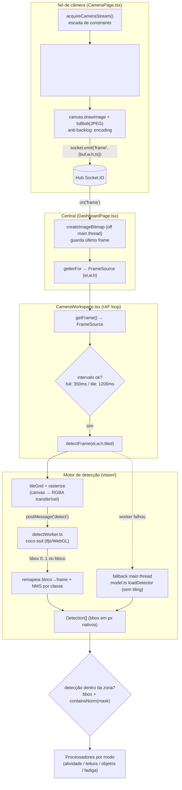

# Núcleo de Visão Computacional — Captura de Câmera e Motor de Detecção

> Documento técnico (regenerado a partir do código-fonte). Cobre a aquisição da câmera,
> o ciclo de captura/transmissão de frames, o motor de detecção de objetos (coco-ssd em
> Web Worker, com tiling e NMS), o modelo de zonas e as máscaras de zona, e como tudo se
> conecta aos processadores por modo.
>
> Arquivos documentados:
> `src/camera/acquire.ts`, `src/cameraConfig.ts`, `src/frame.ts`,
> `src/vision/detect.ts`, `src/vision/detectWorker.ts`, `src/vision/model.ts`,
> `src/zones.ts`, `src/zoneMask.ts` (e seus pontos de uso em `src/routes/CameraPage.tsx`,
> `src/routes/DashboardPage.tsx` e `src/CameraWorkspace.tsx`).

---

## 1. Visão geral da arquitetura

O MVP separa dois papéis, ligados por um hub Socket.IO (ver `APP_CONFIG.net` em
`src/config.ts:132`):

- **Nó de câmera** (`src/routes/CameraPage.tsx`): apenas *adquire* a câmera local, codifica
  frames em JPEG e os transmite ao hub. Não processa nada. A LGPD é respeitada porque o
  processamento/controle fica na central (ver comentário em `src/routes/CameraPage.tsx:109`).
- **Central / Dashboard** (`src/routes/DashboardPage.tsx` + `src/CameraWorkspace.tsx`):
  recebe os frames, os decodifica em `ImageBitmap`, roda a detecção e os processadores por
  zona, e desenha a cena.

O contrato de "fonte de frame" entre essas camadas é o tipo `FrameSource`
(`src/frame.ts:3`):

```ts
export type FrameSource = {
  el: HTMLImageElement | HTMLCanvasElement | HTMLVideoElement | ImageBitmap;
  w: number; h: number;   // dimensões NATIVAS do frame
};
```

`el` é o que o canvas e os modelos consomem; `w`/`h` são as dimensões nativas. O outro tipo
compartilhado é `NormRect` (`src/frame.ts:6`), um retângulo normalizado `0..1` no espaço do
frame, base da geometria de zonas.

---

## 2. Aquisição da câmera (`src/camera/acquire.ts`)

A aquisição é **somente webcam/getUserMedia** — não há RTSP nem ingestão de stream de rede
no nó (o "streaming" acontece depois, via Socket.IO, a partir do JPEG). O código foi portado
das boas práticas do `sensor_fadiga_mvp` (cabeçalho em `src/camera/acquire.ts:1`).

### 2.1. Pré-condições e erros tipados

`acquireCameraStream()` (`src/camera/acquire.ts:31`) retorna um `MediaStream` ou lança um
`CameraAcquireError` (`src/camera/acquire.ts:8`) com um `kind` legível para a UI:

| `kind` | Quando |
|---|---|
| `insecure` | Fora de contexto seguro (sem HTTPS e não é localhost) |
| `unsupported` | `navigator.mediaDevices.getUserMedia` indisponível |
| `denied` | Permissão negada/bloqueada (`NotAllowedError`/`SecurityError`) |
| `notfound` | Sem câmera no dispositivo (`NotFoundError`) |
| `error` | Falha genérica |

Etapas executadas:

1. **Contexto seguro** — `isSecureCameraContext()` (`src/camera/acquire.ts:13`) aceita
   `window.isSecureContext` ou hostnames de localhost (`localhost`, `127.0.0.1`, `::1`,
   conjunto em `src/camera/acquire.ts:5`).
2. **Suporte** — verifica `navigator.mediaDevices?.getUserMedia` (`:33`).
3. **Pré-checagem de permissão** — consulta a Permissions API
   (`navigator.permissions.query({ name: "camera" })`, `:37`); se `denied`, falha cedo.
   A API pode não existir em alguns WebViews — nesse caso o erro é ignorado e o fluxo segue.
4. **Escada de constraints** (`ladder`, `src/camera/acquire.ts:42`) — tenta resoluções em
   ordem decrescente até alguma funcionar:
   - `1280×720`, `facingMode: { ideal: "user" }`
   - `960×540`, `facingMode: environment` no Android / `user` caso contrário
     (Android detectado por `isAndroid()`, `src/camera/acquire.ts:19`)
   - `true` (qualquer câmera/qualquer resolução)

   Em `OverconstrainedError`/`NotFoundError` o laço passa para o próximo nível (`:55`);
   qualquer outro erro é mapeado por `mapDom()` (`src/camera/acquire.ts:23`) e relançado.

### 2.2. Onde é usado

Em `src/routes/CameraPage.tsx:41`: o stream é atribuído a um `<video>`
(`v.srcObject = stream; await v.play()`), e o `kind` do erro é traduzido em status/mensagem
de UI (`src/routes/CameraPage.tsx:46`). No `cleanup` os tracks são parados
(`src/routes/CameraPage.tsx:93`).

---

## 3. Ciclo de captura e transmissão de frames

### 3.1. Lado do nó de câmera (produtor) — `src/routes/CameraPage.tsx`

Após adquirir o stream, o nó conecta ao hub Socket.IO com `role: "camera"` e seu `id`/`label`
(`src/routes/CameraPage.tsx:53`). O perfil de captura inicial vem de `APP_CONFIG.net`
(`frameWidth=1280`, `frameFps=15`, `jpegQuality=0.82`; `src/config.ts:147-149`).

A função `sendFrame()` (`src/routes/CameraPage.tsx:63`) roda em `setInterval` na cadência
`1000 / frameFps` (`:77`):

1. Calcula `w = frameWidth` e `h` proporcional ao vídeo (`:66`).
2. `ctx.drawImage(v, 0, 0, w, h)` num canvas oculto (`:69`).
3. `canvas.toBlob(..., "image/jpeg", jpegQuality)` (`:72`) — JPEG **binário** (não base64;
   ~⅓ menor, sem custo de string no transporte).
4. `socket.emit("frame", { buf, w, h, ts })` com o `ArrayBuffer` (`:74`).

Há **anti-backlog**: a flag `encoding` descarta um novo frame enquanto o encode anterior não
terminou (`src/routes/CameraPage.tsx:62,65`).

A central pode **elevar o perfil de captura** via evento `capture`
(`src/routes/CameraPage.tsx:81`) — por exemplo, no modo leitura de código de barras, que
exige alta resolução (presets em `src/config.ts:77`). Mudança de `fps` reinicia o timer.

### 3.2. Lado da central (consumidor) — `src/routes/DashboardPage.tsx`

O dashboard escuta `frame` (`src/routes/DashboardPage.tsx:39`) e mantém apenas o **último**
frame por câmera num `FrameEntry` (`src/routes/DashboardPage.tsx:14`), descartando atrasados.
A decodificação é feita **fora da main thread** com `createImageBitmap` em `drainDecode`
(`src/routes/DashboardPage.tsx:53`); ao concluir, o `ImageBitmap` antigo é liberado com
`.close()` (`:54`). Há controle de "uma decodificação por vez" via `decoding`/`pending` (`:51`).

A central expõe a cada câmera um getter `() => FrameSource | null`
(`getterFor`, `src/routes/DashboardPage.tsx:70`) que devolve `{ el: bmp, w, h }`. Esse getter
é passado como prop `getFrame` ao `CameraWorkspace`/`FadigaView`.

---

## 4. Motor de detecção de objetos

A detecção usa **coco-ssd** (`@tensorflow-models/coco-ssd`) sobre **TensorFlow.js**
(`@tensorflow/tfjs`). A inferência do coco-ssd era o gargalo que travava a UI na main thread,
especialmente com N câmeras disputando GPU/thread; por isso ela roda num **Web Worker** e é
naturalmente serializada entre câmeras (cabeçalho em `src/vision/detectWorker.ts:2`).

### 4.1. Modelo compartilhado (fallback) — `src/vision/model.ts`

`loadDetector()` (`src/vision/model.ts:7`) carrega **uma única** instância do coco-ssd
(`base: "lite_mobilenet_v2"`), compartilhada por todas as câmeras. Exporta os tipos
`Detector` e `Detection` (= `cocoSsd.DetectedObject`). Este módulo é o **fallback de main
thread** quando o worker não inicia.

### 4.2. O worker — `src/vision/detectWorker.ts`

Roda fora da main thread (backend WebGL via OffscreenCanvas). Protocolo de mensagens:

- `init { base }` (`src/vision/detectWorker.ts:30`) → carrega o modelo com
  `cocoSsd.load({ base })` (lazy/singleton em `ensure`, `:20`) e responde `ready`, ou
  `error` em falha.
- `detect { id, rgba, w, h, maxBoxes, minScore }` (`:36`) → reconstrói um `ImageData` a
  partir dos pixels RGBA recebidos (`:39`), roda `model.detect(imgData, maxBoxes, minScore)`
  e responde `result` com as detecções **normalizadas `0..1` ao próprio bloco** (bbox
  dividido por `w`/`h`, `:43`). Erros viram `result` com lista vazia (`:46`).

> Nota: o `base` usado no worker vem de `APP_CONFIG.detection.base` (`"mobilenet_v2"`,
> `src/config.ts:13`), enviado no `init` (`src/vision/detect.ts:31`). Ou seja, o worker usa
> `mobilenet_v2` (melhor recall) e o fallback de main thread usa `lite_mobilenet_v2`.

### 4.3. O cliente / orquestrador — `src/vision/detect.ts`

Este módulo coordena worker + tiling + remapeamento + NMS, com fallback.

**Singleton do worker** (`src/vision/detect.ts:14`): `ensureDetectClient()`
(`src/vision/detect.ts:20`) cria o `Worker` via
`new Worker(new URL("./detectWorker.ts", import.meta.url), { type: "module" })` (`:23`),
registra os handlers de mensagem (`ready`/`error`/`result`, `:24`) e envia `init`. Em
paralelo, **aquece** o fallback de main thread com `loadDetector()` (`:33`). Falhas marcam
`workerFailed` e zeram o worker (`:27,30,34`). `detectReady()` (`:37`) indica worker pronto
**ou** falho.

**`detectFrame(el, nativeW, nativeH, tiled)`** (`src/vision/detect.ts:99`) — entrada
principal. Retorna `Detection[]` com **bbox em PIXELS do frame nativo** (compatível com o
pipeline existente). Lógica:

1. **Sem worker pronto** (`:101`):
   - Se ainda carregando (não falhou) → retorna `[]` (não cai no main thread à toa).
   - Se o worker falhou → fallback de main thread `loadDetector().detect(...)`, **sem
     tiling** (para não bloquear a UI), só com `maxBoxes`/`minScore` afinados (`:103`).
2. **Com worker** → tiling:
   - `tileGrid(tiled)` (`src/vision/detect.ts:49`) gera os blocos como frações `0..1` do
     frame. Com `tiled=true` usa `C.tiles` (`cols:2, rows:2, overlap:0.12`,
     `src/config.ts:23`); senão, um bloco único cobrindo o frame.
   - `rasterize(el, nativeW, nativeH, tile)` (`src/vision/detect.ts:85`) recorta o bloco num
     canvas reutilizável (`scratch`), reduzido para `detectTileWidth=512` px
     (`src/config.ts:22`), e extrai os pixels via `getImageData` (`willReadFrequently:true`).
     O `ArrayBuffer` resultante é **transferível**.
   - `detectTile(rgba, w, h)` (`src/vision/detect.ts:39`) envia `detect` ao worker
     (transferindo o buffer) e resolve via mapa `pending` por `id`.
   - As caixas de cada bloco (normalizadas ao bloco) são **remapeadas** para fração do frame
     inteiro (`:115`).
   - Quando há tiling com mais de um bloco, aplica **NMS por classe** (`nms`,
     `src/vision/detect.ts:70`; IoU em `:62`) com `nmsIoU=0.45` (`src/config.ts:24`) para
     fundir duplicatas nas bordas sobrepostas.
   - Por fim converte as frações de volta para **pixels nativos** (`:119`).

Por que tiling: recortar o frame faz objetos pequenos/distantes ficarem relativamente maiores
no input 300×300 do SSD, melhorando o recall em cenas amplas/densas (`src/config.ts:20`).

### 4.4. Parâmetros de detecção (`src/config.ts`)

| Parâmetro | Valor | Papel |
|---|---|---|
| `detection.base` | `mobilenet_v2` | base do coco-ssd no worker (`:13`) |
| `objectIntervalMs` | `350` | cadência de inferência na câmera **aberta/full** (`:15`) |
| `objectIntervalMsTile` | `1200` | cadência nas **tiles** do mosaico (economiza GPU) (`:16`) |
| `maxBoxes` | `40` | teto de detecções por inferência (`:17`) |
| `minScore` | `0.25` | limiar bruto do coco (baixo de propósito; filtra por classe depois) (`:18`) |
| `detectTileWidth` | `512` | largura (px) de cada bloco enviado ao modelo (`:22`) |
| `tiles` | `{cols:2,rows:2,overlap:0.12}` | grid do tiling (`:23`) |
| `nmsIoU` | `0.45` | IoU para fundir duplicatas nas bordas (`:24`) |
| `occupancyClasses` | `person, truck, car, bus, motorcycle, bicycle` | classes de ocupação (`:19`) |

---

## 5. Configuração por câmera (`src/cameraConfig.ts`)

`CameraCfg` (`src/cameraConfig.ts:10`) guarda metadados por câmera (LGPD: sem imagens),
persistidos em `localStorage` sob a chave `vp-camcfg-<cameraId>` (`src/cameraConfig.ts:14`):

- `modo: CameraMode` — `"atividade"` (padrão) | `"leitura"` | `"objetos"` | `"fadiga"`
  (`src/cameraConfig.ts:8`). Decide o pipeline.
- `pontoLeitura` — ponto lógico do modo leitura (default `APP_CONFIG.reading.defaultPonto`).
- `capture: CapturePreset` — `"media" | "alta" | "maxima"` (default `"alta"`).
- `selectedClasses` — classes ativas no modo objetos (default = todas, `OBJECT_KEYS`).

`getCameraCfg()` (`src/cameraConfig.ts:16`) lê e **valida/saneia** cada campo (com fallback
para defaults em qualquer erro de parse); `setCameraCfg()` (`:31`) grava em JSON.

> Observação: este é o "modo de câmera" legado. O modelo atual é **modo por zona** (seção 6),
> e `loadZones` usa o `cameraConfig` apenas para **migrar** câmeras antigas.

---

## 6. Sistema de zonas (`src/zones.ts`)

Modelo do "**Modo por Zona**": uma câmera tem N zonas; **cada zona roda o pipeline do seu
próprio modo na sua ROI** (cabeçalho `src/zones.ts:2`).

### 6.1. Modelo `Zone` (`src/zones.ts:14`)

```ts
type Zone = {
  id; label;
  x; y; w; h;          // bounding box / ROI, normalizado 0..1
  modo: ZoneMode;      // "atividade" | "leitura" | "objetos" | "fadiga"
  mask?: string;       // máscara em grade codificada (opcional; área irregular)
  idleAlertMs; sensitivity; atividade;   // campos do modo atividade
  ponto;                                  // campo do modo leitura
  selectedClasses;                        // campos do modo objetos
};
```

A geometria é normalizada `0..1`. Quando `mask` está ausente, a zona é o retângulo cheio
(`x,y,w,h`) — retrocompatibilidade (`src/zones.ts:13`). `DEFAULT_GRID` é `{cols:32, rows:18}`
(`src/zones.ts:10`). `withDefaults()` (`src/zones.ts:27`) preenche os campos de **todos** os
modos com defaults (de `APP_CONFIG`), respeitando o que já existe.

### 6.2. Persistência e migração

- Chave `localStorage`: `vp-zones-<cameraId>` (`src/zones.ts:22`).
- `saveZones()` (`:42`) / `loadZones(cameraId, cameraLabel)` (`:47`).
- `newZoneId()` (`:24`) gera IDs únicos por câmera.

`loadZones` faz **migração de formato** (`src/zones.ts:47-67`):
- Se alguma zona já tem `modo` → formato novo, só normaliza (`:53`).
- Senão, deriva do `cameraConfig` legado: `leitura` cria uma faixa central de leitura (`:58`);
  `objetos` aplica `modo:"objetos"` às zonas/uma zona cheia (`:60`); `atividade` (default)
  usa as zonas antigas ou as **zonas-semente** de `APP_CONFIG.defaultZones`
  (`src/config.ts:153`: Expedição, Carga, Estoque, Espera) (`:66`).

Cores/labels por modo: `ZONE_MODE_COLOR` (`src/zones.ts:69`) e `ZONE_MODE_LABEL` (`:70`).

---

## 7. Máscaras de zona (`src/zoneMask.ts`)

Uma zona deixa de ser só um retângulo e passa a ser um **conjunto de células pintadas** numa
grade (área irregular, descontínua, com furos). O módulo concentra estrutura e operações
(SRP/DRY); o editor (UI) e os processadores apenas **consomem** (`src/zoneMask.ts:1`).

### 7.1. Estrutura e operações

```ts
type Mask = { cols: number; rows: number; bits: Uint8Array };  // 1 = pintada
```

- `createMask` / `clearMask` / `anySet` (`src/zoneMask.ts:7,17,16`).
- `maskGet` / `maskSet` (`:9,12`) — acesso por célula.
- `cellAtNorm(m, nx, ny)` (`:20`) — célula que contém um ponto normalizado.
- **`containsNorm(m, nx, ny)`** (`:23`) — testa se um ponto `0..1` cai numa célula pintada
  (usado para "este objeto está dentro da zona?").
- `fillRectNorm` (`:28`) — pinta/apaga um retângulo normalizado.
- `paintBrush(col, row, rad, on)` (`:35`) — pincel quadrado por raio (em células).
- `maskBBoxNorm` (`:40`) — bounding box normalizada das células pintadas (para ROI/recorte);
  `null` se vazia.
- `maskFromRect` (`:69`) — converte retângulo em máscara cheia (retrocompat).

### 7.2. (De)serialização compacta

`encodeMask` (`src/zoneMask.ts:50`) empacota os bits em bytes e os codifica em base64 no
formato `"<cols>x<rows>:<base64>"`; `decodeMask` (`:56`) faz o inverso (e retorna `null` se a
string for inválida). Esse é o valor guardado em `Zone.mask`.

### 7.3. Edição e aplicação (em `src/CameraWorkspace.tsx`)

- **Cache de máscara** por zona (`getMask`, `src/CameraWorkspace.tsx:377`) — decodifica de
  `z.mask` e memoiza por string codificada.
- **Edição/pintura**: `ensureMaskForPaint` (`:383`) parte de `decodeMask` ou
  `maskFromRect(DEFAULT_GRID...)`; o commit (`:407`) chama `encodeMask` + `maskBBoxNorm` e
  faz `patchZone` salvando `mask` e o novo bounding box `x,y,w,h`.
- **Aplicação na detecção**: `containsFn(z)` (`src/CameraWorkspace.tsx:161`) devolve, quando
  há máscara, um predicado `(nx,ny) => containsNorm(mask, nx, ny)`; `zoneAtAtiv` (`:164`)
  primeiro testa o bounding box e depois refina pela máscara — assim uma detecção só conta
  para a zona se cair numa célula realmente pintada.

---

## 8. Pipeline integrado: frame → detecção → zona

O laço de processamento está em `CameraWorkspace.tsx`, num `requestAnimationFrame`
(`src/CameraWorkspace.tsx:192-288`):

1. `ensureDetectClient()` é chamado uma vez (`src/CameraWorkspace.tsx:134`); as zonas são
   carregadas com `loadZones` (`:133`).
2. A cada frame: `getFrame()` devolve o `FrameSource` (o `ImageBitmap` decodificado pela
   central).
3. Cadência adaptativa: `objInterval = mode === "full" ? objectIntervalMs : objectIntervalMsTile`
   (`src/CameraWorkspace.tsx:219`). Com guarda `detectingRef` para não sobrepor inferências
   (`:220`).
4. `detectFrame(f.el, f.w, f.h, mode === "full")` (`src/CameraWorkspace.tsx:222`) — tiling
   ligado só na câmera aberta (`full`); o resultado fica em `detsRef`.
5. As detecções (bbox em pixels nativos) são atribuídas a zonas via bounding box + máscara
   (`containsNorm`), e cada zona alimenta o processador do seu `modo`
   (`AtividadeProcessor`, `LeituraProcessor`, `ObjetosProcessor`, e `FadigaView` recebe um
   recorte de ROI via `cropFor`, `src/CameraWorkspace.tsx:151`).

### 8.1. Diagrama (Mermaid)



### 8.2. Diagrama (ASCII, resumido)

```
[Câmera webcam] --getUserMedia--> [<video>] --drawImage/toBlob--> JPEG
        |                                                            |
        |                                   socket.emit("frame", buf)|
        v                                                            v
   acquire.ts                                                   Hub Socket.IO
                                                                     |
                                                  on("frame") + createImageBitmap
                                                                     |
                                                          FrameSource {el,w,h}
                                                                     |
                                            CameraWorkspace rAF (throttle por modo)
                                                                     |
                                                   detectFrame(el,w,h,tiled)
                                                  /                          \
                                       worker pronto                    worker falhou
                                           |                                  |
                              tileGrid->rasterize->worker            model.ts (main thread,
                              (coco-ssd) -> remap + NMS                  sem tiling)
                                           \                                  /
                                            ----> Detection[] (px nativos) <--
                                                          |
                                          bbox + containsNorm(mask) por zona
                                                          |
                                   Processadores: atividade | leitura | objetos | fadiga
```

---

## 9. Pontos de atenção / a confirmar

- **Sem RTSP/ingestão de rede no nó**: a aquisição é exclusivamente `getUserMedia` (webcam).
  O "stream" para a central é uma sequência de JPEGs via Socket.IO. (a confirmar se há
  intenção futura de RTSP — não há código para isso nos arquivos analisados.)
- **Divergência de `base`**: worker usa `mobilenet_v2` (de `APP_CONFIG.detection.base`),
  enquanto o fallback `model.ts` usa `lite_mobilenet_v2` fixo (`src/vision/model.ts:8`). É
  intencional (recall vs. custo) mas vale registrar.
- O **filtro por classe** (ex.: `occupancyClasses`, `selectedClasses`) e a contagem por zona
  acontecem nos processadores (fora do escopo destes arquivos); `detectFrame` devolve todas
  as detecções acima de `minScore`.
- Os modos **leitura** (código de barras) e **fadiga** (MediaPipe) usam pipelines próprios
  (config em `src/config.ts:63` e `:104`) e não passam por `vision/detect.ts`.
